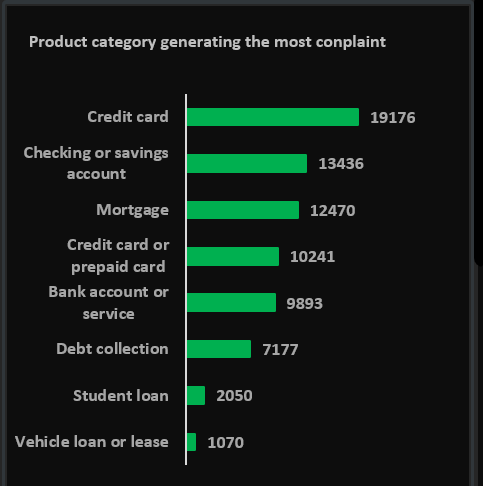

# FINANCIAL CONSUMER COMPLAINTS ANALYSIS
---

# Table of Contents
---
- [Analysis Overview](#analysis-overview)
- [Data Source](#data-source)
- [Tools Used](#tools-used)
- [Data Cleaning & Preparation](#data-cleaning--preparation)
- [Skills Demonstrated](#skills-demonstrated)
- [Insights](#insights)
- [Recommendations](#recommendations)
- [Dashboard](#dashboard)
- [Conclusion](#conclusion)

---

## Analysis Overview
---
Financial institutions receive thousands of consumer complaints every year — 
but without proper analysis, these complaints are just noise. This project 
analyses 75,513 consumer complaints submitted to the CFPB (Consumer Financial 
Protection Bureau) between December 2011 and October 2020 to uncover which 
products, states, and processes were generating the most pressure on support 
teams — and why.

Key questions answered include:
- Which financial products generate the most complaints?
- Which states are most affected and why?
- What is causing delays in complaint responses?
- Why are customers still disputing after receiving a response?
- What response type is most effective at preventing disputes?

---

## Data Source
---
- **Dataset:** CFPB Consumer Complaint Database
- **Source:** Kaggle
- **Size:** 75,513 records
- **Period:** December 2011 – October 2020
- **Fields include:** Product, Sub-product, Issue, Sub-issue, 
  Consumer complaint narrative, Company response, State, 
  Submitted via, Date received, Date sent to company

![Dataset preview — attach your image here]

---

## Tools Used
---
- **Microsoft Excel:** Primary tool for data cleaning, 
  analysis and dashboard development
- **Pivot Tables:** Used to aggregate and summarise 
  complaint volumes by product, state, response type 
  and time period
- **Power Query:** Used for data transformation, 
  standardisation and column formatting
- **Excel Charts & Slicers:** Used to build two 
  interactive dashboards with dynamic filtering

---

## Data Cleaning & Preparation
---
Before analysis could begin, the dataset required 
significant preparation to ensure accuracy and consistency.

**Step 1 — Imported and inspected the dataset**

Loaded the raw CSV file into Excel and performed an 
initial inspection to understand the structure, 
identify blank fields, and assess data quality.

![Raw dataset import — attach your image here]

**Step 2 — Handled missing values**

Several columns contained blank entries — particularly 
in the Consumer Complaint Narrative and Sub-issue fields. 
These were assessed and handled appropriately depending 
on whether the column was needed for analysis.

![Missing values check — attach your image here]

**Step 3 — Standardised date columns**

The Date Received and Date Sent to Company columns were 
reformatted to a consistent date format to enable 
time-based analysis including year-over-year comparisons 
and monthly trend calculations.

![Date formatting — attach your image here]

**Step 4 — Created calculated columns**

New columns were created to support deeper analysis:
- **Year** — extracted from Date Received for 
  year-over-year trend analysis
- **Month** — extracted for seasonal pattern analysis
- **Days to Response** — calculated as the difference 
  between Date Received and Date Sent to Company to 
  identify response delays
- **Timely Response Flag** — categorised responses 
  as timely or untimely based on the Timely Response column

![Calculated columns — attach your image here]

**Step 5 — Validated and cleaned categorical fields**

Product, State, Submitted Via, and Company Response 
columns were checked for inconsistencies, extra spaces, 
and formatting errors. All values were standardised 
for accurate grouping in Pivot Tables.

![Data validation — attach your image here]

---

## Skills Demonstrated
---
- Data Cleaning & Preparation in Excel and Power Query
- Pivot Table Development and Aggregation
- Calculated Column Creation
- Year-over-Year Comparative Analysis
- Root Cause Analysis using the 5-Why Framework
- Interactive Dashboard Design with Slicers
- Data Storytelling and Business Recommendation Writing
- Time-Series and Trend Analysis

---

## Insights
---

### Insight 1 — Credit cards drive 25.4% of all complaints and 50% of all disputes

Out of 75,513 total complaints, credit cards alone 
account for 19,176. But the bigger problem is what 
happens after: of the 7,363 disputes filed across 
all products, 3,696 (50%) came specifically from 
credit card resolutions. Even after customers 
received a response, half of credit card complainants 
were still not satisfied. The specific pain points 
are billing disputes (3,203 cases) and APR/interest 
rate issues (1,704 cases).

**Key Takeaway:**
The problem is not the product itself — it is 
specifically how billing disputes and interest rate 
issues are being handled and communicated to customers.

---

### Insight 2 — 4 states generate 41% of all national complaints

California (12,107), New York, Florida, and Texas 
together account for over 31,000 of the 75,513 total 
complaints. These are the highest-population states 
with the most active financial product users. Within 
each of these states, credit cards rank #1 and 
mortgages rank #2 in California and New York specifically.

![Complaints by state map — attach your image here]

**Key Takeaway:**
Support capacity allocated to these states does not 
reflect the actual complaint concentration. A 
one-size-fits-all staffing model is failing the 
highest-volume regions.

---

### Insight 3 — Delays are a process failure, not a staffing problem

1,469 complaints (2%) received untimely responses. 
Bank account and checking/savings products account 
for 59.9% of all delays. The root cause is the 
absence of pre-approved resolution workflows for 
the most common delay-causing issues: managing an 
account (291 delays), deposits and withdrawals (267), 
and low funds issues (125). Every case is being 
treated from scratch.

![Delay analysis chart — attach your image here]

**Key Takeaway:**
Building structured resolution workflows for these 
specific complaint types would eliminate the majority 
of the delay problem without adding headcount.

---

### Insight 4 — Explanations prevent disputes but quality is the missing piece

Closed with explanation covers 64.81% of all 
resolutions and is the most effective dispute 
prevention tool in the data. However 10% of 
customers are still disputing even after receiving 
a closed with explanation response — which means 
the explanations themselves are not meeting the 
standard required to fully resolve the complaint.

![Response type breakdown — attach your image here]

**Key Takeaway:**
Improving explanation quality and response templates 
specifically for credit card resolutions would 
directly lower the 10% dispute rate without 
additional cost.

---

## Recommendations
---

**Immediate (0–30 days)**
- Replace email complaint intake with a structured 
  web form. Email averages a 5.99-day intake lag 
  vs web at 1.32 days
- Set a 3-day maximum SLA for referral complaints

**Short-Term (1–3 months)**
- Design pre-approved resolution workflows for 
  managing an account and deposits/withdrawals 
  complaint types
- Scale support capacity in California, New York, 
  Florida and Texas to match actual complaint load

**Quality Improvement**
- Rewrite credit card response templates especially 
  for billing disputes and APR issues
- Track dispute rate monthly to measure improvement

**Long-Term (3–6 months)**
- Build an early-warning system that flags any 
  product with a month-over-month complaint spike 
  above 15%
- Introduce seasonal staffing pre-plans for the 
  June–September peak period

---

## Dashboard
---
Two interactive dashboards were built in Excel — 
Dashboard 1 covers complaint trends and product/state 
breakdowns. Dashboard 2 focuses on operational 
performance including response delays, dispute rates 
and intake channel analysis.

![Dashboard 1 — Complaint Trends and Overview — attach your image here]

![Dashboard 2 — Operational Performance and Response Analysis — attach your image here]

---

## Conclusion
---
This analysis of 75,513 financial consumer complaints 
reveals that the problem is not random — it is 
concentrated, predictable and fixable. Credit cards 
are the dominant complaint driver. Four states 
generate nearly half of all national complaints. 
Delays are caused by missing workflows, not missing 
staff. And disputes persist because explanation 
quality is inconsistent.

The recommendations provided give financial 
institutions a clear, structured path to reducing 
complaint volumes, improving response times and 
cutting dispute rates — all without requiring 
significant new investment.

Data does not lie. It just needs someone willing 
to listen to it.

---

Thank you for reading!

Let's connect:
[LinkedIn](https://www.linkedin.com/in/peace-ada-95b341341)  
[Portfolio](https://peace-ada.github.io/Data-Portfolio/)
